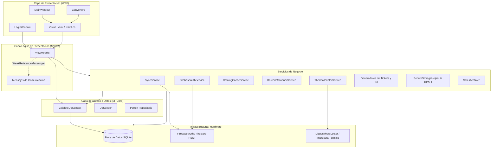

# Arquitectura del Proyecto - Cajolote

Este documento detalla la arquitectura de software, patrones de diseño, estructura de carpetas y flujos de datos de la aplicación de escritorio **Cajolote**.

---

## 🏗️ Patrón de Arquitectura General: MVVM

La aplicación está construida sobre la plataforma **.NET 10.0** para Windows, utilizando **WPF** (Windows Presentation Foundation) y sigue el patrón **MVVM** (Model-View-ViewModel). El desacoplamiento y comunicación se facilita mediante la librería `CommunityToolkit.Mvvm`.

### Diagrama de Relaciones de Arquitectura

---

## 📁 Estructura de Directorios

El proyecto está organizado de la siguiente manera:

| Directorio | Propósito |
| :--- | :--- |
| **`Assets/`** | Recursos gráficos como logotipos, imágenes y animaciones Lottie (`waiting.json`, `Accepted.json`). |
| **`Converters/`** | Convertidores WPF (`IValueConverter`) que transforman datos para mostrarlos en la UI (ej. convertir claves de recursos a iconos). |
| **`Data/`** | Configuración de Entity Framework Core. Contiene el [CajoloteDbContext.cs](../Data/CajoloteDbContext.cs) (mapeo SQLite) y [DbSeeder.cs](../Data/DbSeeder.cs). |
| **`Messages/`** | Clases de mensajes para el servicio de mensajería débil (`WeakReferenceMessenger`), facilitando comunicación desacoplada (ej. solicitar diálogos desde un ViewModel). |
| **`Migrations/`** | Archivos generados por Entity Framework Core para rastrear y aplicar migraciones de base de datos SQLite. |
| **`Models/`** | Clases de dominio/entidades (ej. `Product`, `Category`, `Sale`, `Note`, `ManualDebt`, `StoreProfile`) y objetos de sesión como `LocalSession`. |
| **`Repositories/`** | Abstracción de acceso a datos mediante `IRepository<T>` y `Repository<T>`, además de implementaciones de almacenamiento cifrado como `EncryptedUserRepository`. |
| **`Services/`** | Lógica de negocio reusable: servicios de impresión térmica, generación de reportes, autenticación Firebase, sincronización en la nube, optimización de base de datos y escaneo de códigos de barra. |
| **`ViewModels/`** | Lógica de presentación de las vistas. Manejan la reactividad y comandos enlazados a la interfaz gráfica. |
| **`Views/`** | Código de interfaz gráfica XAML (`UserControl` y `Window`) y su correspondiente lógica subyacente de interacción directa (code-behind). |

---

## 🛠️ Servicios Clave de Negocio

La funcionalidad del sistema se delega en servicios especializados, la mayoría de los cuales están registrados como **Singletons** en la inyección de dependencias (`IServiceProvider`):

1. **`FirebaseAuthService`**: Gestiona el inicio de sesión, renovación de tokens JWT y cierre de sesión mediante Firebase Auth.
2. **`SecureStorageHelper`**: Serializa y almacena la información de sesión en el disco local (`session.dat`), cifrándola mediante la **API de Protección de Datos de Windows (DPAPI)** a nivel del usuario actual.
3. **`SyncService`**: Sincroniza en segundo plano los datos locales de ventas, deudas y perfiles de tienda con las colecciones correspondientes en Firestore, utilizando llamadas REST HTTP autenticadas de forma segura.
4. **`SalesArchiver`**: Mantiene optimizado el rendimiento de SQLite. Archiva ventas pagadas del mes anterior, moviendo los registros a las tablas históricas correspondientes (`HistoricalSales` y `HistoricalSaleDetails`).
5. **`ICatalogCacheService`**: Servicio de caché en memoria que acelera las operaciones del punto de venta (POS) manteniendo los artículos cargados como entidades desconectadas (`AsNoTracking()`).
6. **`ThermalPrinterService`**: Se comunica con impresoras de tickets ESC/POS físicas utilizando los puertos serie de la computadora (`System.IO.Ports`).
7. **`TicketGenerator` / `NoteReceiptGenerator` / `SalesReportGenerator`**: Generan reportes de ventas y recibos en formato estructurado (HTML/PDF) usando la librería `QuestPDF`.
8. **`BarcodeScannerService`**: Utiliza un gancho de teclado a nivel de ventana principal para procesar lecturas automáticas del escáner de códigos de barra sin interrumpir los controles con foco de texto.

---

## 🔄 Flujo de Inicio de Aplicación y Autenticación

Al arrancar la aplicación ([App.xaml.cs](../App.xaml.cs)):

1. **Registro de Inyección de Dependencias (DI):** Se configuran todos los `DbContext`, `Repositories`, `Services` y `ViewModels`.
2. **Aplicación de Migraciones:** EF Core ejecuta automáticamente `DbContext.Database.Migrate()` para crear o actualizar la estructura SQLite local.
3. **Poblado Inicial (Seeding):** `DbSeeder` verifica e inserta categorías iniciales o productos base si la base de datos está vacía.
4. **Verificación de Sesión Cifrada:** Se intenta restaurar la sesión del usuario mediante `SecureStorageHelper`.
   * **Si existe sesión válida y token activo:** Se inicializa `MainWindow` directamente.
   * **Si no hay sesión o ha expirado:** Se abre `LoginWindow`.
