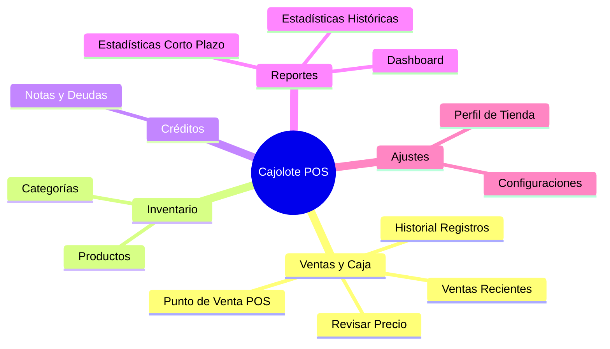

# Catálogo de Funcionalidades - Cajolote

Este documento contiene el catálogo completo de las características y funcionalidades provistas por la aplicación **Cajolote**, organizadas por cada uno de sus módulos y vistas ([Views](../Views)).

---

## 📋 Resumen del Catálogo de Módulos

El sistema está compuesto por los siguientes módulos interactivos accesibles desde la barra de navegación lateral:

---

## 🔍 Detalle de Funcionalidades por Interfaz/Vista

### 1. Ventana Principal ([MainWindow](../MainWindow.xaml))
Es el contenedor principal de la aplicación que organiza la navegación y coordina la integración de hardware y servicios.
* **Barra de Navegación Lateral:** Permite alternar entre los diferentes módulos y resalta visualmente la pestaña activa.
* **Integración del Lector de Código de Barras:** Captura las lecturas del escáner mediante un gancho global (`Attach(this)`), redirigiendo el código automáticamente al Punto de Venta o al Consultador de Precios según la vista activa.
* **Indicador de Conectividad en Tiempo Real:** Muestra visualmente si la terminal tiene acceso a internet mediante notificaciones y cambios de color dinámicos.
* **Sincronización al Inicio:** Realiza una sincronización automática del perfil de la tienda y las ventas locales no subidas antes de cargar el menú principal.
* **Monitoreo de Optimización:** Ejecuta en segundo plano la archivación automática de ventas viejas al abrir la aplicación, mostrando una pantalla de carga para informar al usuario.
* **Atajos de Teclado (Accesos Rápidos):** Permite navegar entre módulos usando combinaciones de teclas (ej. `Alt + 1` para Dashboard, `Alt + 2` para Punto de Venta, etc.).

### 2. Autenticación ([LoginWindow](../LoginWindow.xaml))
Pantalla inicial para control de acceso del personal de la tienda.
* **Inicio de Sesión Seguro:** Valida las credenciales de correo electrónico y contraseña contra Firebase Auth.
* **Registro de Nuevos Usuarios:** Permite dar de alta nuevas cuentas de propietario en la nube.
* **Recuperación de Contraseña:** Envía correos automáticos para restablecer contraseñas perdidas.
* **Persistencia de Sesión:** Almacena la sesión de forma cifrada localmente para omitir la autenticación al reiniciar el programa.

### 3. Panel de Resumen ([DashboardView](../Views/DashboardView.xaml))
Tablero visual rápido con métricas y gráficas del rendimiento del día en curso.
* **Tarjetas de KPI de Hoy:**
  * Cantidad de transacciones realizadas.
  * Ingreso total acumulado en caja.
  * Total de productos unitarios/granel vendidos.
  * Monto promedio por ticket de venta.
* **Ventas por Hora:** Gráfica de líneas interactiva que mapea la fluctuación de ingresos a lo largo de las horas de operación del día.
* **Ventas por Categoría:** Gráfica de pastel interactiva; al hacer clic en una rebanada o su leyenda, muestra dinámicamente el nombre de la categoría e ingresos acumulados en el centro del gráfico.
* **Top Productos Vendidos:** Gráfica de barras horizontal que visualiza cuáles son los artículos de mayor demanda hoy.

### 4. Punto de Venta ([PosView](../Views/PosView.xaml))
Módulo principal para registrar ventas y cobrar a clientes de manera ágil.
* **Entrada de Productos Flexible:**
  * Escaneo directo con lector de código de barras.
  * Búsqueda por entrada de texto (nombre o barcode) con autocompletado interactivo.
  * Panel de "Productos Rápidos" personalizable para artículos frecuentes (sin código).
* **Ventas a Granel (Peso):** Detecta si el producto se vende por peso (ej. kg) y abre un modal numérico para ingresar la cantidad exacta o decimal.
* **Gestión del Carrito de Compras:**
  * Modificación rápida de cantidades por pieza (+ / - / teclado).
  * Edición del precio de venta unitario directamente en el carrito para promociones especiales.
  * Eliminación de artículos individuales o vaciado completo del carrito.
* **Opciones de Cobro:**
  * **Pago en Efectivo:** Calcula de manera automática el cambio a devolver al cajero tras registrar el monto recibido.
  * **Cargar a Cuenta (Fiado):** Asocia la venta a una nota de crédito del cliente para acumular deuda pendiente de cobro.
* **Impresión de Tickets:** Genera el comprobante de venta de forma digital (PDF) o física mediante impresoras térmicas ESC/POS configuradas.

### 5. Consultador de Precios ([RevisarPrecioView](../Views/RevisarPrecioView.xaml))
Pantalla limpia y optimizada para uso rápido del cliente o cajero.
* **Búsqueda Rápida:** Muestra de forma inmediata el precio, nombre, código, categoría y el ícono de un producto al escanearlo o buscarlo.
* **Acciones Directas desde Consulta:**
  * Acceder al panel completo de edición de dicho producto.

### 6. Catálogo de Artículos ([ProductosView](../Views/ProductosView.xaml))
Gestor de inventario para controlar el catálogo y su clasificación.
* **Búsqueda Avanzada:** Filtra productos por nombre, código de barras, precio exacto o categoría asignada, con límites de visualización configurables para evitar lentitud.
* **Administración de Productos (CRUD):**
  * Creación y edición de datos (nombre, código, precio de venta).
  * Asignación de categorías de agrupación.
  * Parámetro "Producto Rápido" para que aparezca en el Punto de Venta principal.
  * Parámetro "A granel" para definir el tipo de venta (peso/unidad).
  * Selección de íconos personalizados para facilitar la identificación visual del producto.
  * Eliminación de productos con confirmación de seguridad.
* **Administración de Categorías (CRUD):**
  * Creación rápida de nuevas categorías.
  * Renombrado de categorías existentes.
  * Eliminación de categorías (valida que no tengan productos enlazados para evitar registros huérfanos).

### 7. Ventas Recientes ([RecientesView](../Views/RecientesView.xaml))
Módulo para consultar, reimprimir o editar las transacciones del día.
* **Listado del Día:** Muestra las últimas ventas con estado de cobro, total e indicadores de edición o sincronización.
* **Acciones Rápidas:**
  * Reimprimir ticket de venta (térmico o PDF).
  * Editar renglones o importes de una venta registrada.
  * Marcar como cobrada una venta fiada.

### 8. Registro e Historial ([RegistrosView](../Views/RegistrosView.xaml))
Consulta completa del historial acumulado de ventas.
* **Filtros por Fecha:** Búsqueda entre rangos de fechas específicos.
* **Visualización de Ventas Archivadas:** Acceso unificado a tablas activas (`Sales`) e históricas (`HistoricalSales`).
* **Exportación y Reportes:** Generación de reportes PDF detallados por periodo.

### 9. Control de Cuentas y Deudas ([NotasView](../Views/NotasView.xaml))
Gestión de créditos,fiados y abonos de clientes.
* **Directorio de Clientes con Deuda:** Listado de notas activas y liquidadas.
* **Detalle de Cuenta:** Desglose de ventas cargadas a la nota y cargos manuales (`ManualDebt`).
* **Registro de Abonos:** Registro de pagos parciales o totales con actualización en tiempo real del saldo restante.
* **Recibo de Abono:** Generación e impresión de comprobantes de pago de deuda.

### 10. Estadísticas de Corto Plazo ([EstadisticasView](../Views/EstadisticasView.xaml))
Análisis comparativo de rendimiento reciente.
* **Filtros Semanales y Mensuales:** Métricas agrupadas por periodos estándar.
* **Gráficas Comparativas:** Comparación de ventas por día y por categoría.

### 11. Estadísticas Históricas ([EstadisticasTotalesView](../Views/EstadisticasTotalesView.xaml))
Análisis macro del histórico completo del negocio.
* **Consolidado Histórico:** Métricas que contemplan ventas archivadas y activas.
* **Tendencias de Largo Plazo:** Comportamiento de ventas por año y mes.

### 12. Perfil del Negocio ([PerfilView](../Views/PerfilView.xaml))
Datos de la tienda impresos en encabezados de recibos y reportes.
* **Información General:** Nombre comercial, dirección, teléfono y mensaje personalizado.
* **Logotipo de la Tienda:** Carga y vista previa de la imagen institucional.
  * Integra un recortador interactivo ([ImageCropWindow](../Views/ImageCropWindow.xaml)) para ajustar la escala y forma del logotipo que se imprime en los recibos.

### 13. Configuraciones ([ConfiguracionView](../Views/ConfiguracionView.xaml))
Ajustes técnicos del sistema y periféricos.
* **Impresora Térmica:** Selección del puerto serie COM, velocidad de transmisión y pruebas de impresión.
* **Base de Datos y Sincronización:** Estado de sincronización en nube con Firestore y optimización manual de almacenamiento.
